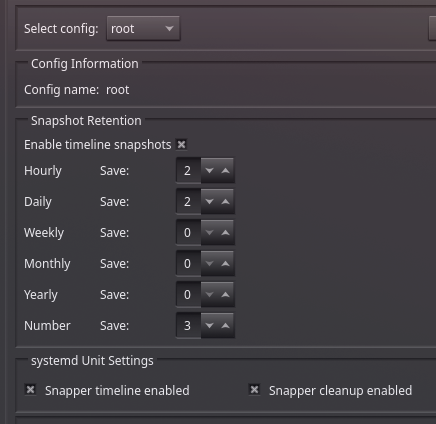

# Omarchy System Setup Guide

A setup guide for Omarchy 4. Omarchy 4 uses Hyprland Lua user overrides and a
Quickshell-based desktop shell. Do not copy the old Waybar, SwayOSD, hypridle,
or custom lid-switch instructions from older Omarchy releases.

---

## Table of Contents

1. [Initial Software Installation](#initial-software-installation)
2. [Keyboard Configuration](#keyboard-configuration)
3. [Restore Configurations](#restore-configurations)
4. [Hyprland Display Management](#hyprland-display-management)
5. [UI Customization](#ui-customization)
6. [Window Manager Configuration](#window-manager-configuration)
7. [Login and Lock Screens](#login-and-lock-screens)
8. [System Services](#system-services) — includes macOS-style safe sleep (19)
9. [Backup Configuration](#backup-configuration)
10. [Development Tools](#development-tools)
11. [Audio Configuration](#audio-configuration)

---

## Initial Software Installation

### 1. Install Google Chrome

Download and install Google Chrome browser.

### 2. Install Warp Terminal

Install Warp terminal **before** running OS updates:

```bash
curl -L -O "https://releases.warp.dev/stable/v0.2026.02.04.08.20.stable_03/warp-terminal-v0.2026.02.04.08.20.stable_03-1-x86_64.pkg.tar.zst"
```

---

## Keyboard Configuration

### 3. Setup keyd for macOS-style Keyboard Mapping

Install and configure keyd to remap keyboard controls:

```bash
yay -S keyd
sudo mkdir -p /etc/keyd
```

Create the configuration file:

```bash
sudo tee /etc/keyd/default.conf << 'EOF'
[ids]
*

[main]
leftcontrol = leftmeta
leftmeta = leftalt
leftalt = leftcontrol

rightcontrol = rightmeta
rightmeta = rightalt
rightalt = rightcontrol
EOF
```

Enable and start the service:

```bash
sudo systemctl enable --now keyd
sudo keyd reload
```

---

## Restore Configurations

### 4. Restore Dotfiles

Restore dotfiles or full home directory from your backup location.

---

## Hyprland Display Management

### 5. Use Omarchy 4 Lid and Sleep Handling

Omarchy 4 handles lid events, clamshell mode, display reconciliation, and
sleep locking through its built-in Hyprland bindings and system helpers. Do
not create a custom lid script, add legacy `bindl` rules, or run the old idle
daemon for this purpose.

The native bindings call:

- `omarchy-system-lid-close` when the lid closes
- `omarchy-hyprland-monitor-clamshell` when the lid opens
- `omarchy-system-sleep-monitor` to lock before suspend

Inspect the active bindings and sleep monitor with:

```bash
omarchy menu keybindings --print
pgrep -a omarchy-system-sleep-monitor
```

### 6. Configure Monitors

Omarchy 4 monitor overrides belong in `~/.config/hypr/monitors.lua`:

```lua
local omarchy_gdk_scale = 2
local omarchy_monitor_scale = "auto"

hl.env("GDK_SCALE", tostring(omarchy_gdk_scale))
hl.monitor({ output = "", mode = "preferred", position = "auto", scale = omarchy_monitor_scale })
```

List connected monitors and supported modes with:

```bash
hyprctl monitors all
```

Do not edit `/usr/share/omarchy/` or the generated defaults under
`~/.local/share/omarchy/`.

---

## UI Customization

### 7. Install Inter Font

Install the Inter font family for system-wide use.

### 8. Configure Font Rendering

Create or edit `~/.config/fontconfig/fonts.conf` and add the following inside the `<fontconfig>` block:

```xml
<!-- Font rendering settings for macOS-like appearance -->
<match target="pattern">
  <edit name="antialias" mode="assign"><bool>true</bool></edit>
  <edit name="hinting" mode="assign"><bool>true</bool></edit>
  <edit name="hintstyle" mode="assign"><const>hintslight</const></edit>
  <edit name="lcdfilter" mode="assign"><const>lcddefault</const></edit>
  <edit name="rgba" mode="assign"><const>rgb</const></edit>
  <edit name="stem-darkening" mode="assign"><bool>true</bool></edit>
  <edit name="stemdarkening" mode="assign"><bool>true</bool></edit>
</match>
```

### 9. Install Icon Theme

Install Colloid icon theme from: https://github.com/vinceliuice/Colloid-icon-theme

This repository is already cloned at `~/devcave/Colloid-icon-theme`. Install the
user icon theme without `sudo`:

```bash
cd ~/devcave/Colloid-icon-theme
./install.sh
```

### 10. Configure GTK Theme Settings

Install and use nwg-look:

- Set default font to **Inter**
- Enable all antialiasing options
- Set icon theme to **Colloid**

For Omarchy themes, keep a small user overlay so theme changes do not restore
the stock Yaru icon theme. For example, create
`~/.config/omarchy/themes/tokyo-night/icons.theme` containing:

```text
Colloid-Dark
```

Re-apply the theme after creating the overlay:

```bash
omarchy theme set tokyo-night
```

---

## Window Manager Configuration

### 11. Configure Blur Effects

Edit `~/.config/hypr/looknfeel.lua`, not the legacy `looknfeel.conf`:

```lua
hl.config({
  decoration = {
    blur = {
      enabled = true,
      size = 7,
      passes = 3,
      ignore_opacity = true,
      noise = 0.06,
      contrast = 1.5,
      xray = false,
      new_optimizations = true,
      popups = true,
      special = true,
    },
  },
})
```

### 12. Enable Rounded Windows

In `~/.config/hypr/looknfeel.lua`:

```lua
hl.config({
  decoration = {
    rounding = 8,
  },
})
```

### 13. Configure Input Settings

In `~/.config/hypr/input.lua`, enable natural scrolling for both mouse and
touchpad, three-finger workspace gestures, and border resizing:

```lua
hl.config({
  input = {
    natural_scroll = true,
    touchpad = {
      natural_scroll = true,
      clickfinger_behavior = true,
      scroll_factor = 0.4,
    },
  },
})

hl.gesture({ fingers = 3, direction = "horizontal", action = "workspace" })
```

In `~/.config/hypr/looknfeel.lua`:

```lua
hl.config({
  general = {
    resize_on_border = true,
    extend_border_grab_area = 15,
    hover_icon_on_border = true,
  },
})
```

After changing any Hyprland Lua file, validate the configuration:

```bash
hyprctl reload
hyprctl configerrors
```

### 14. Configure Omarchy Minimize (OmaVeil)

Download the Omarchy 4-compatible release. The old GitHub release uses legacy
Hyprland dispatch syntax and does not work with Omarchy 4:

```bash
curl -fL https://github.com/somtooo/OmaVeil/releases/download/2/omaveil -o /tmp/omaveil
sudo install -m 0755 /tmp/omaveil /usr/local/bin/omaveil
```

The installed binary should be at:

```
/usr/local/bin/omaveil
```

To build from the local source instead:

```bash
cd ~/devcave/OmaVeil/omaveil
cargo build --release
sudo install -m 0755 target/release/omaveil /usr/local/bin/omaveil
```

Add the keybindings to `~/.config/hypr/bindings.lua`:

```lua
o.bind("SUPER + H", "Minimize window", "omaveil minimize")
o.bind("SUPER + I", "Browse minimized windows", "omaveil restore")
o.bind("SUPER + U", "Restore last minimized", "omaveil restore-last")
o.bind("SUPER + SHIFT + U", "Restore all minimized", "omaveil restore-all")
```

Verify the executable and bindings:

```bash
omaveil show
omarchy menu keybindings --print
```

### 15. Auto-hide the Status Bar

The bar auto-hides via the `quattrobar-autohide` Python script (repo already
cloned at `~/devcave/quattrobar-autohide`, source:
https://github.com/somtooo/quattrobar-autohide). It hides the bar when a window
overlaps it and reveals it when the cursor hits the top screen edge.

```bash
cd ~/devcave/quattrobar-autohide
make install   # installs to ~/.local/bin
```

Then autostart it from `~/.config/hypr/autostart.lua`:

```lua
o.launch_on_start("quattrobar-autohide")
```

### 16. Clipboard History

Omarchy 4 includes a native clipboard manager. It records text and image
history through the running Quickshell session and stores it under
`~/.local/state/omarchy/`.

- `SUPER + V`: universal paste
- `SUPER + CTRL + V`: open the clipboard history picker
- `CTRL + SHIFT + V`: terminal paste in applications that support that shortcut

Do not add a separate `cliphist` watcher or a `SUPER + V` cliphist pipeline;
that conflicts with Omarchy's universal paste and native picker. Verify the
native watcher and history file with:

```bash
pgrep -a -f 'wl-paste.*shell/plugins/clipboard/capture.sh'
test -s ~/.local/state/omarchy/clipboard-history.json
```

---

## Login and Lock Screens

macOS-style SDDM login theme and lock screen plugin (blurred wallpaper,
circular avatar, frosted pill password field, big clock on the lock screen).
Full install/revert instructions and all theme files are in
[login-and-lock-screens.md](login-and-lock-screens.md).

Quick summary:

```bash
# SDDM login theme
pkexec bash -c 'mkdir -p /usr/share/sddm/themes/macos && cp sddm-macos-theme/* /usr/share/sddm/themes/macos/'
pkexec sed -i 's/^Current=.*/Current=macos/' /etc/sddm.conf.d/10-theme.conf

# Lock screen plugin
mkdir -p ~/.config/omarchy/plugins/som2.lock ~/.local/share/login-look
cp lock-screen-plugin/* ~/.config/omarchy/plugins/som2.lock/
cp sddm-macos-theme/avatar.png ~/.local/share/login-look/
omarchy plugin enable som2.lock
```

---

## System Services

### 17. DisplayLink Driver Setup

If using a DisplayLink dock:

1. Install evdi driver
2. Install displaylink driver
3. **Restart the PC after installation**

### 18. Enable Suspend

Omarchy 4 manages suspend availability through the system menu. Check whether
the suspend action is enabled with:

```bash
omarchy toggle enabled suspend
```

If it is disabled, toggle it with `omarchy toggle suspend`. Do not add a
separate legacy suspend or hypridle service.

### 19. Fix NVIDIA Hibernation Resume

> **Hardware:** ASUS ROG Zephyrus G16 GU605CR (Intel Core Ultra 9 285H + NVIDIA RTX 5070 Ti, 32 GiB RAM, hybrid Intel iGPU + NVIDIA dGPU, Limine UKI, encrypted Btrfs `/` on `/dev/mapper/root` with `/swap/swapfile`).
> **Note:** An earlier draft of this section added `suspend-then-hibernate`/`2h` `HibernateDelaySec` + logind lid drop-ins. **Removed 2026-09-03** — that behavior is not part of Omarchy 4 defaults. **Only the NVIDIA fix is kept.**

#### 19.1 What broke (2026-09-01 — 2026-09-03)

On `2026-09-01 21:31:54` `systemd-logind[999]: hibernate requested` succeeded (`journalctl -b -1`):

```
systemd[1]: Starting System Hibernate...
systemd-sleep[268539]: Performing sleep operation 'hibernate'...
kernel: PM: hibernation: hibernation entry
```

On next boot `2026-09-03 18:40:19` (`journalctl -b 0 -k`) the image was found and fully re-loaded, then aborted:

```
kernel: PM: Image signature found, resuming
kernel: PM: hibernation: resume from hibernation
kernel: PM: Loading and decompressing image data (2341251 pages)...
kernel: PM: Image loading progress: 100%
kernel: PM: Image loading done
kernel: PM: hibernation: Read 9365004 kbytes in 11.77 seconds (795.66 MB/s)
kernel: PM: Image successfully loaded
kernel: NVRM: GPU 0000:01:00.0: PreserveVideoMemoryAllocations module parameter is set. System Power Management attempted without driver procfs suspend interface.
kernel: nvidia 0000:01:00.0: PM: pci_pm_freeze(): nv_pmops_freeze [nvidia] returns -5
kernel: PM: hibernation: Failed to load image, recovering.
kernel: PM: hibernation: resume failed (-5)
```

**Root cause:** The open kernel module (`nvidia-open-dkms` 610.57.04) has a bug in `nv_pmops_freeze()`: it calls `nvidia_suspend(dev, NV_PM_ACTION_HIBERNATE, NV_FALSE)` with `is_procfs_suspend=NV_FALSE` hardcoded. When `NVreg_PreserveVideoMemoryAllocations=1` (`/usr/lib/modprobe.d/gsr-nvidia.conf:1`), this always hits the preserve check and returns `-5`, discarding the hibernation image.

`NVreg_UseKernelSuspendNotifiers=1` (`/usr/lib/modprobe.d/nvidia-sleep.conf:1`) was also tried, but it prevents `/proc/driver/nvidia/suspend` from being created (`nv-procfs.c`: `if (NVreg_UseKernelSuspendNotifiers) create_suspend_file = NV_FALSE`), so `nvidia-sleep.sh` exits 0 (no-op) even when the systemd services are enabled.

#### 19.2 Fix applied (2026-09-03) — minimal, Omarchy defaults untouched

**Step 1: Enable NVIDIA suspend/hibernate helpers**

```bash
pkexec bash -c 'systemctl enable nvidia-hibernate.service nvidia-resume.service nvidia-suspend.service nvidia-suspend-then-hibernate.service'
# creates 6 symlinks:
# /etc/systemd/system/systemd-hibernate.service.wants/nvidia-hibernate.service
# /etc/systemd/system/systemd-suspend.service.wants/nvidia-resume.service + nvidia-suspend.service
# /etc/systemd/system/systemd-hibernate.service.wants/nvidia-resume.service
# /etc/systemd/system/systemd-suspend-then-hibernate.service.wants/nvidia-resume.service + nvidia-suspend-then-hibernate.service
systemctl is-enabled nvidia-hibernate nvidia-resume nvidia-suspend nvidia-suspend-then-hibernate  # -> enabled
```

**Step 2: Disable `NVreg_PreserveVideoMemoryAllocations` (critical)**

The open kernel module cannot hibernate with video memory preservation enabled because `nv_pmops_freeze` hardcodes `is_procfs_suspend=NV_FALSE`. Disable it:

```bash
pkexec bash -c '
  sed -i "s/NVreg_PreserveVideoMemoryAllocations=1/NVreg_PreserveVideoMemoryAllocations=0/" /usr/lib/modprobe.d/gsr-nvidia.conf
  cat /usr/lib/modprobe.d/gsr-nvidia.conf
  limine-mkinitcpio
'
```

> **Tradeoff:** NVIDIA apps (games, CUDA) will lose state on hibernate. Display/compositor is on Intel iGPU, so desktop restores fine. Only `warp-terminal` uses NVIDIA (256MiB) and restarts on resume. Safe for hybrid laptop.

> **Note:** `/usr/lib/modprobe.d/gsr-nvidia.conf` is a package file (`nvidia-utils`); the change may be overwritten on package update. If hibernate breaks again after update, add `/etc/modprobe.d/nvidia.conf` with `options nvidia NVreg_PreserveVideoMemoryAllocations=0` to override.

**Step 3: Revert `UseKernelSuspendNotifiers` back to 1 (optional)**

With `PreserveVideoMemoryAllocations=0`, the kernel suspend notifiers path works correctly and is preferred for modern suspend. Revert the earlier change:

```bash
pkexec bash -c '
  sed -i "s/NVreg_UseKernelSuspendNotifiers=0/NVreg_UseKernelSuspendNotifiers=1/" /usr/lib/modprobe.d/nvidia-sleep.conf
  limine-mkinitcpio
'
```

**That's it.** No systemd sleep/logind drop-ins were added. Omarchy 4 defaults are untouched:

- `/etc/systemd/logind.conf.d/10-ignore-power-button.conf` (Omarchy: `HandlePowerKey=ignore` — `Super+Esc` menu)
- `/etc/systemd/logind.conf.d/20-inhibit-delay.conf` (Omarchy: `InhibitDelayMaxSec=15` — lets `omarchy-system-sleep-lock` lock before suspend)
- No `/etc/systemd/sleep.conf.d/*.conf` — systemd defaults + `omarchy-hibernation-setup` cmdline (`resume=/dev/mapper/root resume_offset=3735407`, `rtc_cmos.use_acpi_alarm=1`) is enough.
- Hyprland `switch:on:Lid Switch` -> `omarchy-system-lid-close` still locks + handles clamshell; logind `HandleLidSwitch` still defaults to `suspend`.

`omarchy-hibernation-setup` (`/usr/share/omarchy/bin/omarchy-hibernation-setup`) originally created `/swap/swapfile` (`btrfs filesystem mkswapfile -s MemTotal`), the `/swap` subvolume, the `resume=` + `rtc_cmos` drop-ins, and `/etc/mkinitcpio.conf.d/omarchy_resume.conf` (`HOOKS+=(resume)`). That setup is kept verified:

```bash
omarchy hibernation available && echo ok  # checks /proc/swaps excluding zram > /sys/power/image_size (13G < 31G)
cat /proc/cmdline | tr " " "\n" | grep resume
cat /sys/power/resume; cat /sys/power/resume_offset
```

No `/usr/share/omarchy/default/systemd/system-sleep/force-igpu` is installed to `/usr/lib/systemd/system-sleep/` (it needs `supergfxctl`, not present; `asusd` handles the G16). The shipped `/usr/lib/systemd/system-sleep/nvidia`, `keyboard-backlight` (prevents ASUS KB LED hang on S4), and `unmount-fuse` (lazy-unmounts `gvfsd-fuse` before freeze) are kept.

#### 19.3 Verify hibernation

```bash
# 1) nvidia helpers active
systemctl is-enabled nvidia-hibernate.service nvidia-resume.service nvidia-suspend.service nvidia-suspend-then-hibernate.service

# 2) after reboot, verify params applied
cat /proc/driver/nvidia/params | grep -i preserve  # should show 0
cat /proc/driver/nvidia/params | grep -i notifier  # should show 1 (if reverted)

# 3) dry-run hibernate (saves RAM to /swap/swapfile then powers off — save work first)
systemctl hibernate
# after power-on, should resume to desktop instantly; check:
journalctl -b 0 -k | grep -E "PM: hibernation|nvidia.*PM:"
# expect: PM: hibernation: resume from hibernation + no resume failed (-5)
# previous hibernation entry:
journalctl -b -1 | grep -E "PM: hibernation: hibernation entry|Performing sleep operation"

# 4) revert the fix if needed
pkexec systemctl disable nvidia-hibernate.service nvidia-resume.service nvidia-suspend.service nvidia-suspend-then-hibernate.service
pkexec bash -c 'sed -i "s/NVreg_PreserveVideoMemoryAllocations=0/NVreg_PreserveVideoMemoryAllocations=1/" /usr/lib/modprobe.d/gsr-nvidia.conf; limine-mkinitcpio'
```

Rebuild UKI only if resume params or `mkinitcpio` hooks change: `pkexec limine-mkinitcpio`.
### 20. Setup Btrfs Snapshots

Omarchy creates Snapper snapshots for system updates. These are separate from
Pika Backup and can be used for system rollback. Check the existing snapshots
with:

```bash
sudo snapper -c root list
```

For regular timeline snapshots, configure the `root` profile in
**Btrfs Assistant** and enable the Snapper timers:

```bash
sudo snapper -c root set-config \
  TIMELINE_CREATE=yes \
  TIMELINE_LIMIT_HOURLY=2 \
  TIMELINE_LIMIT_DAILY=2 \
  TIMELINE_LIMIT_WEEKLY=0 \
  TIMELINE_LIMIT_MONTHLY=0 \
  TIMELINE_LIMIT_YEARLY=0
sudo systemctl enable --now snapper-timeline.timer snapper-cleanup.timer
```

`snapper-timeline.timer` creates the snapshots. The cleanup timer only removes
old snapshots; enabling cleanup alone does not create them. Keep Omarchy's
number-snapshot retention setting when changing timeline retention so update
rollback snapshots are not removed prematurely.


---

## Backup Configuration

### 21. Mount Google Drive with rclone

#### Prerequisites

- Install rclone: `pacman -S rclone`
- Configure Google Drive remote: `rclone config` -  [rclone-gdrive](https://rclone.org/drive/)

#### Setup

**Create mount directory:**

```bash
sudo mkdir -p /media/gdrive
sudo chown $USER:$USER /media/gdrive
```

**Create systemd user service:**

Create `~/.config/systemd/user/rclone-gdrive.service`:

```ini
[Unit]
Description=Mount Google Drive with rclone
After=network-online.target

[Service]
Type=notify
ExecStart=/usr/bin/rclone mount g-drive: /media/gdrive --vfs-cache-mode full
ExecStop=/usr/bin/fusermount3 -u /media/gdrive
Restart=on-failure
RestartSec=5

[Install]
WantedBy=default.target
```

**Enable and start the service:**

```bash
systemctl --user daemon-reload
systemctl --user enable --now rclone-gdrive.service
```

#### Usage

Check status:

```bash
systemctl --user status rclone-gdrive.service
```

Manual control:

```bash
systemctl --user stop rclone-gdrive.service
systemctl --user start rclone-gdrive.service
```

#### Notes

- Using `/media` ensures Nautilus displays the mount with a drive icon in the sidebar
- `--vfs-cache-mode full` enables full file caching, required for apps like Pika Backup
- The service auto-starts on login and restarts on failure

### 22. Configure Pika Backup

1. Install **Pika Backup**
2. Configure backup destination to `/media/gdrive`
3. Set backup schedule:
   - **Hourly**: 1 backup
   - **Daily**: 3 backups
   - **Weekly**: 1 backup
4. Enable "Regularly create backups"

---

## Development Tools

### 23. Install Zed Editor

1. Install Zed from their official website (not from AUR)
2. Add the binary installation location to PATH if not already added
3. Verify `zed` CLI command works

---

## Audio Configuration

### 24. Use the Omarchy 4 Audio OSD

Omarchy 4 replaced SwayOSD with a Quickshell-based OSD. Do not install or
configure `swayosd`; the old `max_volume = 150` setting is not supported by
the native volume command.

Use the native audio commands instead:

```bash
omarchy audio output volume raise
omarchy audio output volume lower
omarchy audio output volume mute-toggle
omarchy audio output volume +1
omarchy audio output volume -1
```

The volume keys and audio panel use the same commands and show the native
Omarchy OSD automatically.

## Additional Resources

- [Hyprland Documentation](https://wiki.hyprland.org/)
- [rclone Documentation](https://rclone.org/)

---
